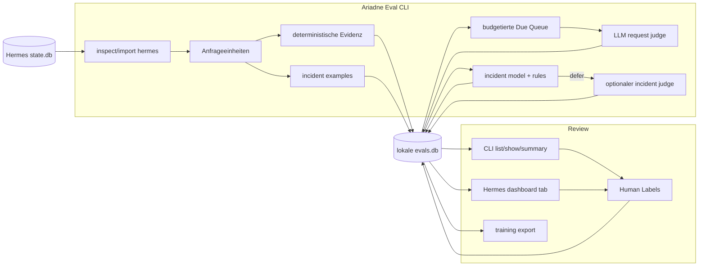

# Ariadne Eval

**Lokale Evaluation für Hermes-Agent-Sitzungen.**

[English](README.md) | Deutsch | [中文](README.zh.md) | [Español](README.es.md) | [Русский](README.ru.md)

Ariadne Eval liest Hermes-Sitzungsverlauf und macht daraus prüfbare Evidenz. Es betrachtet jeweils eine Benutzeranfrage: die Anfrage, die Antwort des Assistenten, die nahe Tool-Aktivität, die nächste Benutzerreaktion, falls vorhanden, und wie viel vermeidbare Reibung in diesem Arbeitsabschnitt entstanden ist.

Es ist für Fälle gebaut, die im finalen Transcript leicht untergehen:

- der Assistent meldet Abschluss, aber ein Befehl oder Tool ist fehlgeschlagen;
- der Agent verbraucht zusätzliche Turns mit demselben Tool, API-Aufruf oder Shell-Befehl;
- die nächste Benutzernachricht ist eine Korrektur, Beschwerde oder Wiederholung derselben Anfrage;
- ein Tool-Ergebnis sieht alarmierend aus, kann aber ein erwartbarer Fehler oder schlechte Eingabe sein statt ein echter Incident;
- Reviewer brauchen einen lokalen Satz akzeptierter Incident-Labels für späteres Training und Kalibrierung.

Ariadne Eval bleibt lokal. Es liest Hermes `state.db`, schreibt eine Sidecar-SQLite-Datenbank, ruft Judges nur über explizite CLI-Befehle auf und speichert kein verborgenes Provider-Reasoning.

## Was aufgezeichnet wird

| Bereich | Aufgezeichnete Daten |
|---|---|
| Anfrageeinheit | Eine Eval Unit pro Benutzernachricht, mit begrenztem Vor-Kontext, Assistentenantwort, Tool-Nachrichten und nächster Benutzerreaktion, falls verfügbar. |
| Deterministische Evidenz | Tool-Fehler, wiederholte Aktionen, API/Tool-Zählungen, Hinweise auf Completion Claims, Reaktionsklassifikation und andere Trace-Signale. |
| Anfrageurteil | `succeed`, `failed`, `mishandled` oder `prolonged`, plus `request_friction_score` von `0.0` bis `1.0`. |
| Incident Review | Tool-Call-Labels: `incident`, `not_incident` oder `unsure`, mit Reason Code, Confidence, Reviewer-Quelle und Kommentaren. |
| Review-Oberflächen | CLI-Ausgabe und ein optionaler Hermes-Dashboard-Tab; beide lesen dieselbe lokale `evals.db`. |

Deterministische Evidenz ist Eingabe, nicht das Urteil. Der Request Judge und menschliche Reviewer entscheiden weiterhin, was der Trace bedeutet.

## Datenpfad



Die CLI ist für Import, Evaluation, Vorhersage, Training und Export zuständig. Das Dashboard liest `evals.db` und kann Labels speichern; es importiert keine Sitzungen und ruft keinen Judge auf.

Lokaler Zustand liegt unter:

```text
$HERMES_HOME/instruction-health/
  config.yaml
  evals.db
  logs/
```

## Installation

```bash
git clone git@github.com:merlinhu1/ariadne-eval.git
cd ariadne-eval
python3 -m venv .venv
. .venv/bin/activate
pip install -e .
```

CLI prüfen:

```bash
agent-health --help
```

Oder direkt aus dem Checkout ausführen:

```bash
PYTHONPATH=src python3 -m agent_health.cli --help
```

## Erster Lauf

Ariadne Eval unter einem Hermes-Profil initialisieren:

```bash
agent-health --hermes-home ~/.hermes init
```

Aktuelle Hermes-Sitzungen vor dem Import ansehen:

```bash
agent-health --hermes-home ~/.hermes inspect hermes --limit 5
```

Aktuelle Sitzungen in die Sidecar-Datenbank importieren:

```bash
agent-health --hermes-home ~/.hermes import hermes --since 24h --limit 100
```

Normalisierte Einheiten und deterministische Signale prüfen:

```bash
agent-health --hermes-home ~/.hermes units --limit 20
agent-health --hermes-home ~/.hermes signals hermes:<session_id>:turn:<n>
```

Den Request Judge für fällige Einheiten ausführen:

```bash
agent-health --hermes-home ~/.hermes eval --due
```

Ergebnisse prüfen:

```bash
agent-health --hermes-home ~/.hermes list --limit 20 --details
agent-health --hermes-home ~/.hermes show hermes:<session_id>:turn:<n>
agent-health --hermes-home ~/.hermes summary
```

`eval --due` ist absichtlich budgetiert. Es betrachtet einen kleinen fälligen Batch, priorisiert Einheiten mit deterministischer Evidenz, überspringt bereits beurteilte Einheiten ohne `--reevaluate` und unterstützt `--dry-run`, bevor Judge-Aufrufe ausgegeben werden.

## Incident-Workflow

Request Scoring fragt: "Wie hat der Agent diese Benutzeranfrage behandelt?" Incident Review fragt enger: "Ist dieser konkrete Tool-Aufruf oder dieses Tool-Ergebnis ein echter Ausführungs-Incident?"

Incident Examples auflisten, die noch Review brauchen:

```bash
agent-health --hermes-home ~/.hermes incident examples --unlabeled --limit 20
```

Einen begrenzten Batch vom Incident Judge labeln lassen:

```bash
agent-health --hermes-home ~/.hermes incident judge-label --limit 20 --max-judge-calls 5
```

Ein Human Label hinzufügen oder korrigieren:

```bash
agent-health --hermes-home ~/.hermes incident label --example-id incident:<id> \
  --label incident --reason-code execution_error --confidence 1.0 \
  --comment "tool failed and the final answer claimed completion"
```

Akzeptierte Labels exportieren, ein lokales Incident-Modell trainieren und ML-first Prediction mit Judge-Deferral ausführen:

```bash
agent-health --hermes-home ~/.hermes incident export-training > incident-training.jsonl
agent-health --hermes-home ~/.hermes incident train --auto-promote
agent-health --hermes-home ~/.hermes incident predict --judge-deferred --max-judge-calls 5
```

Der beabsichtigte Loop beginnt mit Human/LLM-Labels, nutzt danach ein promoviertes lokales Modell für Routineentscheidungen und kann deferred Fälle optional an den LLM Judge geben. Human Corrections bleiben auditierbar und können erneut für Retraining exportiert werden.

## Dashboard

Den optionalen Hermes-Dashboard-Tab installieren:

```bash
agent-health --hermes-home ~/.hermes dashboard install
```

Hermes neu laden oder neu starten und den Ariadne-Eval-Tab öffnen. Er zeigt Request Friction, Status, Anomalien, Sitzungen, Incident Examples, Predictions und Label Controls aus der lokalen `evals.db`.

Das Dashboard ist absichtlich begrenzt: Es ist eine Review-Oberfläche über vorhandenen lokalen Daten, kein Importer, Scheduler oder Judge Runner.

## Grenzen

Ariadne Eval V1 ist kein:

- gehostetes Observability-Produkt;
- residenter Scheduler oder Hintergrund-Daemon;
- passives Hook-Capture-System;
- eigenständiges Web-Dashboard;
- Safety- oder Policy-Evaluator;
- allgemeines Multi-Agent-Adapter-Framework;
- automatischer Prompt-, Memory- oder Skill-Editor.

Der enge Scope ist Absicht: historische Hermes-Sitzungen hinein; lokale Evidenz, Urteile und Review-Labels heraus.

## Entwicklung und Verifikation

Python-Test-Suite ausführen:

```bash
PYTHONDONTWRITEBYTECODE=1 PYTHONPATH=src python3 -m unittest discover -s tests -v
```

Repository-Truth-Checks ausführen:

```bash
/opt/data/node/bin/truthmark check --json
/opt/data/node/bin/truthmark index --json
```

Nützliche Dokumente:

- [V1 design](docs/design.md)
- [architecture overview](docs/architecture/system-overview.md)
- [repo rules for agents](docs/ai/repo-rules.md)
- [behavior truth docs](docs/truth/)
