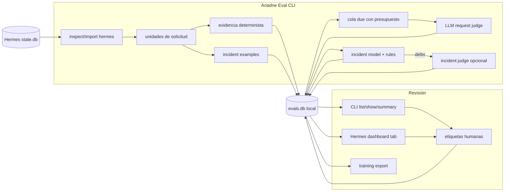

# Ariadne Eval

**Evaluación local para sesiones de Hermes Agent.**

[English](README.md) | [Deutsch](README.de.md) | [中文](README.zh.md) | Español | [Русский](README.ru.md)

Ariadne Eval lee el historial de sesiones de Hermes y lo convierte en evidencia revisable. Mira una solicitud de usuario a la vez: la solicitud, la respuesta del asistente, la actividad de herramientas cercana, la siguiente reacción del usuario cuando existe y cuánta fricción evitable hubo en ese tramo de trabajo.

Está hecho para casos que se pierden fácilmente en una transcripción final:

- el asistente dice que la tarea terminó, pero un comando o herramienta falló;
- el agente gasta turnos repitiendo la misma herramienta, llamada API o comando de shell;
- el siguiente mensaje del usuario es una corrección, una queja o la misma solicitud repetida;
- un resultado de herramienta parece alarmante, pero puede ser un fallo esperado o una mala entrada, no un incidente real;
- los revisores necesitan un conjunto local de etiquetas de incidentes aceptadas para entrenamiento y calibración.

Ariadne Eval se mantiene local. Lee `state.db` de Hermes, escribe una base SQLite sidecar, llama a jueces solo desde comandos CLI explícitos y no guarda reasoning oculto del proveedor.

## Qué se registra

| Área | Datos registrados |
|---|---|
| Unidad de solicitud | Una eval unit por mensaje de usuario, con contexto previo acotado, respuesta del asistente, mensajes de herramientas y la siguiente reacción del usuario cuando existe. |
| Evidencia determinista | Errores de herramientas, acciones repetidas, conteos de API/herramientas, pistas de completion claim, clasificación de reacción y otras señales del trace. |
| Juicio de solicitud | `succeed`, `failed`, `mishandled` o `prolonged`, más `request_friction_score` de `0.0` a `1.0`. |
| Revisión de incidentes | Etiquetas de llamadas a herramientas: `incident`, `not_incident` o `unsure`, con reason code, confidence, fuente del revisor y comentarios. |
| Superficies de revisión | Salida CLI y una pestaña opcional del dashboard de Hermes; ambas leen el mismo `evals.db` local. |

La evidencia determinista es una entrada, no el veredicto. El juez de solicitud y el revisor humano siguen decidiendo qué significa el trace.

## Ruta de datos



La CLI se encarga de importar, evaluar, predecir, entrenar y exportar. El dashboard lee `evals.db` y puede guardar etiquetas; no importa sesiones ni llama a un juez.

El estado local se guarda en:

```text
$HERMES_HOME/instruction-health/
  config.yaml
  evals.db
  logs/
```

## Instalación

```bash
git clone git@github.com:merlinhu1/ariadne-eval.git
cd ariadne-eval
python3 -m venv .venv
. .venv/bin/activate
pip install -e .
```

Comprueba la CLI:

```bash
agent-health --help
```

O ejecútala directamente desde el checkout:

```bash
PYTHONPATH=src python3 -m agent_health.cli --help
```

## Primera ejecución

Inicializa Ariadne Eval bajo un perfil de Hermes:

```bash
agent-health --hermes-home ~/.hermes init
```

Inspecciona sesiones recientes antes de importar:

```bash
agent-health --hermes-home ~/.hermes inspect hermes --limit 5
```

Importa sesiones recientes a la base sidecar:

```bash
agent-health --hermes-home ~/.hermes import hermes --since 24h --limit 100
```

Inspecciona unidades normalizadas y señales deterministas:

```bash
agent-health --hermes-home ~/.hermes units --limit 20
agent-health --hermes-home ~/.hermes signals hermes:<session_id>:turn:<n>
```

Ejecuta el juez de solicitudes para unidades pendientes:

```bash
agent-health --hermes-home ~/.hermes eval --due
```

Revisa resultados:

```bash
agent-health --hermes-home ~/.hermes list --limit 20 --details
agent-health --hermes-home ~/.hermes show hermes:<session_id>:turn:<n>
agent-health --hermes-home ~/.hermes summary
```

`eval --due` está presupuestado a propósito. Considera un lote pequeño de unidades pendientes, prioriza unidades con evidencia determinista, omite unidades ya juzgadas salvo que uses `--reevaluate` y permite `--dry-run` antes de gastar llamadas al juez.

## Flujo de incidentes

El scoring de solicitudes pregunta: "¿cómo manejó el agente esta solicitud del usuario?" La revisión de incidentes pregunta algo más estrecho: "¿esta llamada/resultado de herramienta es un incidente real de ejecución?"

Lista incident examples que aún necesitan revisión:

```bash
agent-health --hermes-home ~/.hermes incident examples --unlabeled --limit 20
```

Deja que el juez de incidentes etiquete un lote acotado:

```bash
agent-health --hermes-home ~/.hermes incident judge-label --limit 20 --max-judge-calls 5
```

Añade o corrige una etiqueta humana:

```bash
agent-health --hermes-home ~/.hermes incident label --example-id incident:<id> \
  --label incident --reason-code execution_error --confidence 1.0 \
  --comment "tool failed and the final answer claimed completion"
```

Exporta etiquetas aceptadas, entrena un modelo local de incidentes y ejecuta predicción ML-first con deferral al juez:

```bash
agent-health --hermes-home ~/.hermes incident export-training > incident-training.jsonl
agent-health --hermes-home ~/.hermes incident train --auto-promote
agent-health --hermes-home ~/.hermes incident predict --judge-deferred --max-judge-calls 5
```

El ciclo previsto es primero etiquetas humanas/LLM, luego un modelo local promovido para decisiones rutinarias, con judgement LLM opcional para casos diferidos. Las correcciones humanas siguen siendo auditables y se pueden exportar de nuevo para reentrenar.

## Dashboard

Instala la pestaña opcional del dashboard de Hermes:

```bash
agent-health --hermes-home ~/.hermes dashboard install
```

Recarga o reinicia Hermes y abre la pestaña Ariadne Eval. Muestra fricción de solicitudes, estados, anomalías, sesiones, incident examples, predicciones y controles de etiquetas desde el `evals.db` local.

El dashboard está limitado a propósito: es una superficie de revisión sobre datos locales existentes, no un importador, scheduler ni ejecutor de jueces.

## Límites

Ariadne Eval V1 no es:

- un producto alojado de observabilidad;
- un scheduler o daemon residente;
- un sistema de captura por hooks pasivos;
- un dashboard web independiente;
- un evaluador de safety o policy;
- un framework general de adaptadores multiagente;
- un editor automático de prompts, memoria o skills.

El alcance estrecho es intencional: entran sesiones históricas de Hermes; salen evidencia local, juicios y etiquetas de revisión.

## Desarrollo y verificación

Ejecuta la suite de tests de Python:

```bash
PYTHONDONTWRITEBYTECODE=1 PYTHONPATH=src python3 -m unittest discover -s tests -v
```

Ejecuta las comprobaciones de verdad del repositorio:

```bash
/opt/data/node/bin/truthmark check --json
/opt/data/node/bin/truthmark index --json
```

Documentos útiles:

- [V1 design](docs/design.md)
- [architecture overview](docs/architecture/system-overview.md)
- [repo rules for agents](docs/ai/repo-rules.md)
- [behavior truth docs](docs/truth/)
