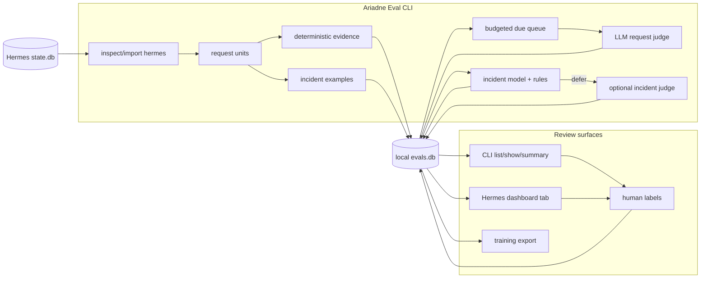

# Ariadne Eval

**Local evaluation for Hermes Agent sessions.**

English | [Deutsch](README.de.md) | [中文](README.zh.md) | [Español](README.es.md) | [Русский](README.ru.md)

Ariadne Eval reads Hermes session history and turns it into reviewable evidence. It looks at one user request at a time: the request, the assistant's response, nearby tool activity, the next user reaction when one exists, and the amount of avoidable friction in that slice of work.

It is built for cases that are easy to miss in a final transcript:

- the assistant says the task is complete, but a command or tool failed;
- the agent spends extra turns repeating the same tool, API call, or shell command;
- the next user message is a correction, complaint, or repeat of the same request;
- a tool result looks alarming, but may be an expected failure or a bad input rather than a real incident;
- reviewers need a local set of accepted incident labels for later training and calibration.

Ariadne Eval stays local. It reads Hermes `state.db`, writes a sidecar SQLite database, calls judges only from explicit CLI commands, and does not store hidden provider reasoning.

## What gets recorded

| Area | Recorded data |
|---|---|
| Request unit | One eval unit per user message, with bounded prior context, assistant response, tool messages, and next-user reaction when available. |
| Deterministic evidence | Tool errors, repeated actions, API/tool counts, completion-claim hints, reaction classification, and other trace signals. |
| Request judgement | `succeed`, `failed`, `mishandled`, or `prolonged`, plus `request_friction_score` from `0.0` to `1.0`. |
| Incident review | Tool-call labels: `incident`, `not_incident`, or `unsure`, with reason code, confidence, reviewer source, and comments. |
| Review surfaces | CLI output and an optional Hermes dashboard tab, both reading the same local `evals.db`. |

Deterministic evidence is input, not the verdict. The request judge and human reviewer still decide what the trace means.

## Data path



The CLI owns import, evaluation, prediction, training, and export. The dashboard reads `evals.db` and can save labels; it does not import sessions or call a judge.

Local state is stored under:

```text
$HERMES_HOME/instruction-health/
  config.yaml
  evals.db
  logs/
```

## Install

```bash
git clone git@github.com:merlinhu1/ariadne-eval.git
cd ariadne-eval
python3 -m venv .venv
. .venv/bin/activate
pip install -e .
```

Check the CLI:

```bash
agent-health --help
```

Or run directly from the checkout:

```bash
PYTHONPATH=src python3 -m agent_health.cli --help
```

## First run

Initialize Ariadne Eval under a Hermes profile:

```bash
agent-health --hermes-home ~/.hermes init
```

Inspect recent Hermes sessions before importing:

```bash
agent-health --hermes-home ~/.hermes inspect hermes --limit 5
```

Import recent sessions into the sidecar database:

```bash
agent-health --hermes-home ~/.hermes import hermes --since 24h --limit 100
```

Inspect normalized units and deterministic signals:

```bash
agent-health --hermes-home ~/.hermes units --limit 20
agent-health --hermes-home ~/.hermes signals hermes:<session_id>:turn:<n>
```

Run the request judge for due units:

```bash
agent-health --hermes-home ~/.hermes eval --due
```

Review results:

```bash
agent-health --hermes-home ~/.hermes list --limit 20 --details
agent-health --hermes-home ~/.hermes show hermes:<session_id>:turn:<n>
agent-health --hermes-home ~/.hermes summary
```

`eval --due` is deliberately budgeted. It considers a small due batch, prioritizes units with deterministic evidence, skips previously judged units unless `--reevaluate` is set, and supports `--dry-run` before spending judge calls.

## Incident workflow

Request scoring asks, "How did the agent handle this user request?" Incident review asks a narrower question: "Is this specific tool call/result a real execution incident?"

List incident examples that still need review:

```bash
agent-health --hermes-home ~/.hermes incident examples --unlabeled --limit 20
```

Let the incident judge label a bounded batch:

```bash
agent-health --hermes-home ~/.hermes incident judge-label --limit 20 --max-judge-calls 5
```

Add or correct a human label:

```bash
agent-health --hermes-home ~/.hermes incident label --example-id incident:<id> \
  --label incident --reason-code execution_error --confidence 1.0 \
  --comment "tool failed and the final answer claimed completion"
```

Export accepted labels, train a local incident model, and run ML-first prediction with judge deferral enabled:

```bash
agent-health --hermes-home ~/.hermes incident export-training > incident-training.jsonl
agent-health --hermes-home ~/.hermes incident train --auto-promote
agent-health --hermes-home ~/.hermes incident predict --judge-deferred --max-judge-calls 5
```

The intended loop is human/LLM labels first, then a promoted local model for routine incident decisions, with optional LLM judgement for deferred cases. Human corrections stay auditable and can be exported again for retraining.

## Dashboard

Install the optional Hermes dashboard tab:

```bash
agent-health --hermes-home ~/.hermes dashboard install
```

Reload or restart Hermes, then open the Ariadne Eval tab. It shows request friction, statuses, anomalies, sessions, incident examples, predictions, and label controls from the local `evals.db`.

By default, installation also registers a quiet Hermes cron watchdog that starts `agent-health scheduler run` when scheduled eval tasks need a consumer. Use `--no-scheduler-watchdog` only if you already supervise the scheduler with systemd, launchd, Docker, or another process manager.

The dashboard is intentionally constrained: it is a review/configuration surface over local data. Page loads do not import sessions, call the judge, or create eval runs; explicit scheduler controls mark tasks due for the scheduler worker.

## Boundaries

Ariadne Eval V1 is not:

- a hosted observability product;
- a passive hook capture system;
- a standalone web dashboard;
- a safety or policy evaluator;
- a general multi-agent adapter framework;
- an automatic prompt, memory, or skill editor.

The narrow scope is intentional: historical Hermes sessions in; local evidence, judgements, and review labels out.

## Development and verification

Run the Python test suite:

```bash
PYTHONDONTWRITEBYTECODE=1 PYTHONPATH=src python3 -m unittest discover -s tests -v
```

Run repository truth checks:

```bash
/opt/data/node/bin/truthmark check --json
/opt/data/node/bin/truthmark index --json
```

Useful docs:

- [V1 design](docs/design.md)
- [architecture overview](docs/architecture/system-overview.md)
- [repo rules for agents](docs/ai/repo-rules.md)
- [behavior truth docs](docs/truth/)
