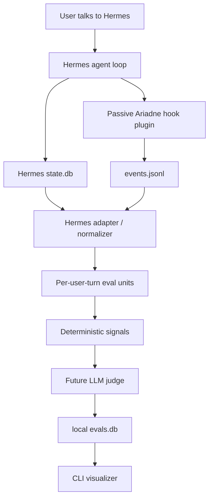

# Ariadne Eval

**A local-first instruction-health evaluator for Hermes Agent sessions.**

Ariadne Eval is a lightweight post-run analysis tool for answering one practical question:

> For each thing I asked my agent to do, did it succeed, fail, get mishandled, or take a weirdly long path — and why?

It is intentionally narrower than Langfuse or a full observability dashboard. The MVP focuses on Hermes Agent first, reads Hermes' local session database, extracts deterministic trace evidence, and stores queryable evaluation data in a local sidecar SQLite database.

---

## What it does

Ariadne Eval turns raw Hermes conversations into inspectable **per-user-request evaluation units**.

```text
Hermes session
  → Hermes state.db + passive hook events
  → one eval unit per user request
  → deterministic signals
  → future LLM judge
  → local evals.db
  → CLI summaries for bumpy turns
```

It is designed to catch cases like:

- the agent claimed it created a file but no tool evidence supports that;
- a tool failed and the final answer did not recover;
- the user had to say “no, that is not what I asked”;
- the agent repeated the same command or tool call unnecessarily;
- the request eventually succeeded, but only after avoidable detours.

---

## Why per-turn evaluation matters

A single Hermes session can contain many user goals. Ariadne Eval evaluates each user message separately instead of scoring only the whole conversation.

Each evaluation unit includes:

- current user request;
- bounded previous conversation context;
- assistant response for that turn;
- tool calls and tool results between request and response;
- deterministic signals such as tool errors, repeated tool calls, and duration;
- the next user message, when available, as reaction evidence.

That next user message is often the clearest signal that the prior turn went wrong:

```text
No, that is not what I asked.
You did not create the file.
Why did you search the web?
Can you actually finish it?
```

---

## Health statuses

Future LLM judging will assign one primary status per eval unit:

| Status | Meaning |
|---|---|
| `succeed` | The user goal was achieved without meaningful avoidable friction. |
| `failed` | The user goal was not achieved. |
| `mishandled` | The agent attempted the task but misunderstood, over-claimed, missed requirements, or used tools badly. |
| `prolonged` | The goal was achieved or nearly achieved, but with unnecessary loops, detours, or excessive steps. |
| `not_evaluable` | There is not enough evidence to judge reliably. |

Status precedence:

```text
failed > mishandled > prolonged > succeed > not_evaluable
```

---

## Current MVP state

Implemented now:

- Hermes `state.db` reader;
- schema-tolerant session/message inspection;
- hidden reasoning-field exclusion;
- per-user-turn normalization;
- next-user reaction capture;
- deterministic signal extraction;
- sidecar SQLite schema;
- passive Hermes plugin scaffold;
- CLI commands for init, inspect, import, units, and signals;
- Truthmark routing and behavior docs.

Still planned:

- LLM judge client through Hermes provider resolution;
- strict JSON judge parsing and repair retry;
- richer `list`, `show`, and `summary` commands;
- full hook-event-to-eval-unit joining;
- plugin installation command;
- scheduled batch evaluation.

---

## Quick start from a checkout

```bash
git clone git@github.com:merlinhu1/ariadne-eval.git
cd ariadne-eval
python3 -m venv .venv
. .venv/bin/activate
pip install -e .
```

The package exposes the placeholder CLI command:

```bash
agent-health --help
```

If you are working directly from source without installing:

```bash
PYTHONPATH=src python3 -m agent_health.cli --help
```

---

## Basic workflow

Initialize Ariadne Eval under a Hermes profile:

```bash
agent-health --hermes-home ~/.hermes init
```

Inspect recent Hermes sessions without using an LLM:

```bash
agent-health --hermes-home ~/.hermes inspect hermes --limit 5
```

Import recent Hermes sessions into the local sidecar database:

```bash
agent-health --hermes-home ~/.hermes import hermes --since 24h --limit 100
```

List normalized eval units:

```bash
agent-health --hermes-home ~/.hermes units --limit 20
```

Show deterministic signals for one eval unit:

```bash
agent-health --hermes-home ~/.hermes signals hermes:<session_id>:turn:<n>
```

Ariadne Eval stores local state under:

```text
$HERMES_HOME/instruction-health/
  config.yaml
  events.jsonl
  evals.db
  logs/
```

---

## Example future CLI output

The visualizer is intended to make bumpy turns easy to find:

```text
Evaluated turns: 118
succeed: 82
failed: 7
mishandled: 18
prolonged: 9
not_evaluable: 2

Top barriers:
1. user_correction: 11
2. excessive_tool_calls: 8
3. missing_tool_use: 6
4. action_misrepresentation: 3
```

And eventually:

```bash
agent-health list --status failed,mishandled,prolonged --since 7d
```

```text
TIME                STATUS       SESSION       TURN  BARRIERS                         REQUEST
2026-05-19 10:42    mishandled   abc123        4     user_correction,missing_tool_use  "Create a markdown design doc..."
2026-05-19 09:10    prolonged    def456        2     repeated_tool_loop,tool_error     "Fix the test failure..."
2026-05-18 22:31    failed       ghi789        1     action_misrepresentation          "Send the email..."
```

---

## Architecture



Key design constraints:

- Hermes `state.db` is the primary source of truth.
- Hooks are passive, fast, and fail-open.
- Hooks never call an LLM and never mutate Hermes behavior.
- Hidden chain-of-thought/provider reasoning fields are excluded.
- Deterministic signals remain useful even when the LLM judge is unavailable.
- Storage is local by default; inference is local only if the configured Hermes model is local.

---

## Development

Run the current test suite:

```bash
PYTHONDONTWRITEBYTECODE=1 PYTHONPATH=src python3 -m unittest discover -s tests -v
```

Run Truthmark checks:

```bash
/opt/data/node/bin/truthmark check --json
/opt/data/node/bin/truthmark index --json
```

Useful docs:

- original design: [`research/agent_instruction_health_evaluator_design1.md`](research/agent_instruction_health_evaluator_design1.md)
- navigable design copy: [`docs/design.md`](docs/design.md)
- architecture overview: [`docs/architecture/system-overview.md`](docs/architecture/system-overview.md)
- repo rules for agents: [`docs/ai/repo-rules.md`](docs/ai/repo-rules.md)
- behavior truth docs: [`docs/truth/`](docs/truth/)

---

## Non-goals for the MVP

Ariadne Eval is not trying to be:

- a hosted observability platform;
- a Langfuse replacement;
- a polished web dashboard;
- a safety/policy evaluator;
- an automatic prompt/memory/skill modifier;
- a multi-user/team analytics product.

The MVP goal is simpler: **make recent Hermes failures and bumpy turns locally visible, explainable, and queryable.**
