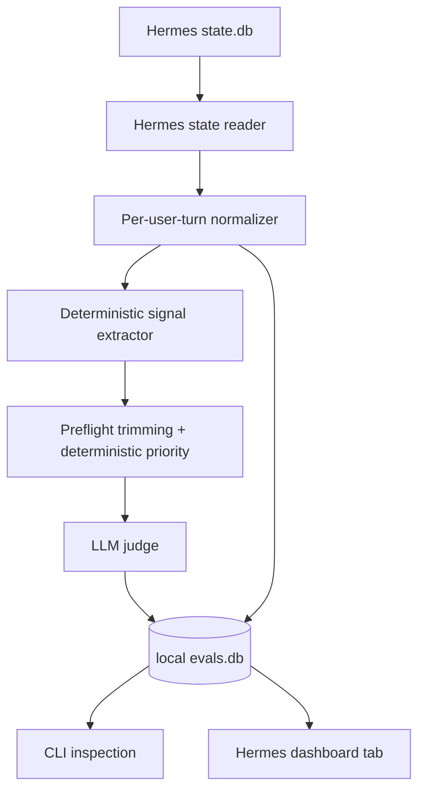

# Ariadne Eval

**A local-first instruction-health evaluator for Hermes Agent sessions.**

Ariadne Eval answers one practical question:

> For each thing I asked Hermes to do, where did it show deterministic incidents or judged anomalies?

V1 is intentionally small, but it still includes an **LLM judge** and a read-only Hermes dashboard tab. The judge turns trace evidence into the actual health status (`succeed`, `failed`, `mishandled`, `prolonged`, or `not_evaluable`). The simplification is that ingestion remains state.db-only and V1 does **not** run a resident scheduler, require passive hook capture, or support non-Hermes adapters.

---

## V1 pipeline

```text
Hermes state.db
  -> one eval unit per user request
  -> state.db-derived tool evidence and next-user reaction
  -> deterministic signals
  -> compact judge input with aggressive preflight trimming
  -> LLM judge using existing Hermes model config
  -> local evals.db
  -> CLI inspection and Hermes dashboard tab
```

This is enough to find common problems:

- a tool failed and the final response did not recover;
- the user had to say “no, that is not what I asked”;
- the same command/tool appears to repeat unnecessarily;
- a request took far more tools/API calls/time than expected;
- the assistant claimed completion but the trace evidence looks weak.

---

## Why state.db-only ingestion first?

Hermes already records the durable conversation history in `state.db`: sessions, messages, tool-call/result messages, timestamps, token counts, model metadata, and session-level counters. That is the lowest-friction source of truth and it works on old sessions without requiring users to install anything in Hermes first.

The earlier passive-hook plugin idea is deferred. Hooks can improve exact runtime telemetry later, but they are not required for a useful V1.

The LLM judge is triggered by an explicit CLI batch command, not by a resident scheduler. The V1 command is `agent-health eval --due`: it loads imported/due eval units from `evals.db`, builds the judge input, calls Hermes' existing model runtime, and writes `llm_evals` plus `anomalies` rows. Judge routing prefers any configured `auxiliary.compression` model/provider first, then falls back to the Hermes main provider/model. Budget guardrails are intentionally conservative: by default one invocation considers at most 10 due candidates, filters them by deterministic priority, makes at most 5 judge calls, skips any unit that already has a prior judgement unless `--reevaluate` is explicit, waits 120 minutes before judging a no-reaction last turn, records provider-reported judge token usage, and prints per-eval context around request, reaction, outcome, and anomaly evidence. Judge strictness is configurable with `--judgement-threshold strict|balanced|relaxed`; the default `strict` threshold requires concrete trace/assistant evidence and should not mark natural follow-ups as anomalies. A future cron/systemd timer can call that same command, but the scheduler is just automation around the CLI, not a required Ariadne component.

Deferred for later:

- passive Hermes hook plugin;
- `events.jsonl` runtime event cache;
- exact tool start/end duration capture;
- approval/interruption runtime telemetry;
- scheduled background evaluation;
- standalone/non-Hermes dashboards;
- non-Hermes adapters.

Kept in V1:

- deterministic signal extraction;
- LLM judge via existing Hermes provider/model resolution;
- strict JSON health statuses and anomaly evidence;
- local SQLite storage for judge results.

---

## Evaluation units

Ariadne Eval evaluates **one user message at a time**, not only whole sessions.

Each normalized unit contains:

- current user request;
- bounded previous context;
- assistant response for that turn, when present;
- tool messages between the request and response;
- next user message, when available, as reaction evidence;
- deterministic signals derived from the unit.

The next user message is important because it often reveals whether the previous response was accepted, corrected, repeated, or complained about.

---

## Health taxonomy

The judge assigns one primary status:

| Status | Meaning |
|---|---|
| `succeed` | The user goal was achieved without meaningful avoidable friction. |
| `failed` | The user goal was not achieved. |
| `mishandled` | The agent attempted the task but misunderstood, over-claimed, missed requirements, or used tools badly. |
| `prolonged` | The goal was achieved or nearly achieved, but with unnecessary loops, detours, or excessive steps. |
| `not_evaluable` | There is not enough evidence to judge reliably. |

Deterministic signals are not the final rating by themselves. They are the judge's evidence pack and the fallback inspection surface when the judge is unavailable.

---

## Current implemented pieces

Implemented now:

- Hermes `state.db` reader;
- schema-tolerant session/message inspection;
- hidden reasoning-field exclusion;
- per-user-turn normalization, including filtering for context-compaction/runtime handoff messages and replayed document uploads;
- next-user reaction capture/classification;
- deterministic signal extraction;
- deterministic event-level incident extraction, including one `tool_error` incident per failed/error-looking tool event;
- deterministic priority prefiltering before judge calls;
- aggressive preflight trimming for large documents, code blocks, image/data blobs, and bulky tool previews;
- local SQLite sidecar schema including judge/anomaly tables;
- judge prompt with trim-policy and configurable-threshold guidance;
- Hermes-provider judge client inheriting `auxiliary.compression` first, then the main model;
- strict JSON judge parsing and repair retry;
- manual `eval --due` command that triggers the LLM judge for due imported units;
- dashboard summary/detail query helpers over the same sidecar data;
- installable Hermes dashboard plugin tab for read-only visualization of statuses, incidents, anomalies, and hot sessions;
- `list`, `show`, and `summary` commands over judged results;
- CLI commands for `init`, `inspect hermes`, `import hermes`, `units`, `incidents`, `signals`, `eval`, `list`, `show`, `summary`, and `dashboard install`;
- Truthmark routing and behavior docs.

Still to implement for full V1:

- signal-noise cleanup for session-level API counts and additional real-world judge calibration;
- more fixtures around real Hermes provider-routing edge cases.

Intentionally not in V1:

- passive Hermes hook plugin installation or hook capture;
- scheduler/cron integration;
- standalone dashboards;
- generic multi-agent adapter framework.

---

## Quick start from a checkout

```bash
git clone git@github.com:merlinhu1/ariadne-eval.git
cd ariadne-eval
python3 -m venv .venv
. .venv/bin/activate
pip install -e .
```

Run the placeholder CLI:

```bash
agent-health --help
```

Or directly from source:

```bash
PYTHONPATH=src python3 -m agent_health.cli --help
```

---

## Basic workflow

Initialize Ariadne Eval under a Hermes profile:

```bash
agent-health --hermes-home ~/.hermes init
```

Inspect recent Hermes sessions without using an LLM:

```bash
agent-health --hermes-home ~/.hermes inspect hermes --limit 5
```

Import recent Hermes sessions into the local sidecar database:

```bash
agent-health --hermes-home ~/.hermes import hermes --since 24h --limit 100
```

List normalized eval units:

```bash
agent-health --hermes-home ~/.hermes units --limit 20
```

Show deterministic signals for one eval unit:

```bash
agent-health --hermes-home ~/.hermes signals hermes:<session_id>:turn:<n>
```

Trigger judging manually:

```bash
agent-health --hermes-home ~/.hermes eval --due
```

Install the optional Hermes dashboard tab after import/eval data exists:

```bash
agent-health --hermes-home ~/.hermes dashboard install
```

Reload or restart the Hermes dashboard and open the Ariadne Eval tab. The tab is read-only; it visualizes `evals.db` and does not import sessions or call the judge.

No built-in scheduler is needed for V1. If automatic periodic evaluation becomes useful later, cron/systemd can run that same command, but keep the default budget guard or set explicit `--max-judge-calls`, `--limit`, and `--min-priority-score` values appropriate for the budget.

Ariadne Eval stores local state under:

```text
$HERMES_HOME/instruction-health/
  config.yaml
  evals.db
  logs/
```

---

## Architecture



Key constraints:

- Hermes `state.db` is the only V1 ingestion source.
- The Hermes dashboard plugin is opt-in and read-only; state.db ingestion and CLI evaluation work without it.
- The LLM judge is required for final ratings.
- The judge uses existing Hermes provider/model configuration by default, so no separate evaluator API key is required. It prefers `auxiliary.compression` when configured, then the Hermes main provider/model.
- Hidden chain-of-thought/provider reasoning fields are excluded.
- SQLite is local under the Hermes profile.
- The dashboard visualizes existing sidecar data and must not become a second evaluator path.

---

## Development

Run the current test suite:

```bash
PYTHONDONTWRITEBYTECODE=1 PYTHONPATH=src python3 -m unittest discover -s tests -v
```

Run Truthmark checks:

```bash
/opt/data/node/bin/truthmark check --json
/opt/data/node/bin/truthmark index --json
```

Useful docs:

- current V1 design: [`docs/design.md`](docs/design.md)
- original design draft: [`research/agent_instruction_health_evaluator_design1.md`](research/agent_instruction_health_evaluator_design1.md)
- architecture overview: [`docs/architecture/system-overview.md`](docs/architecture/system-overview.md)
- repo rules for agents: [`docs/ai/repo-rules.md`](docs/ai/repo-rules.md)
- behavior truth docs: [`docs/truth/`](docs/truth/)

---

## Non-goals for V1

Ariadne Eval V1 is not trying to be:

- a hosted observability platform;
- a Langfuse replacement;
- a passive Hermes hook plugin;
- a standalone polished web dashboard;
- a safety/policy evaluator;
- an automatic prompt/memory/skill modifier;
- a multi-user/team analytics product.

The V1 goal is simpler: **make recent Hermes incidents and judged anomalies locally visible from state.db, judged by the existing Hermes model path, and stored in local SQLite.**
