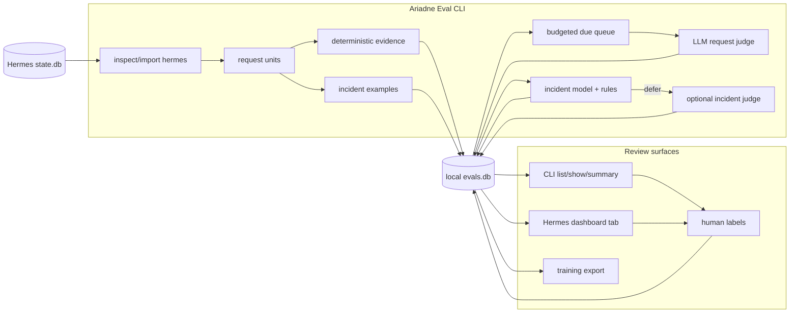

# Ariadne Eval

**Локальная оценка сессий Hermes Agent.**

[English](README.md) | [Deutsch](README.de.md) | [中文](README.zh.md) | [Español](README.es.md) | Русский

Ariadne Eval читает историю сессий Hermes и превращает ее в проверяемые доказательства. Он смотрит на один пользовательский запрос за раз: сам запрос, ответ ассистента, ближайшую активность инструментов, следующую реакцию пользователя, если она есть, и объем устранимого трения в этом фрагменте работы.

Он нужен для случаев, которые легко пропустить в финальном transcript:

- ассистент говорит, что задача выполнена, но команда или инструмент завершились ошибкой;
- агент тратит лишние turn на повтор одного и того же инструмента, API-вызова или shell-команды;
- следующее сообщение пользователя является исправлением, жалобой или повтором того же запроса;
- результат инструмента выглядит тревожно, но может быть ожидаемой ошибкой или плохим вводом, а не реальным incident;
- ревьюерам нужен локальный набор принятых incident labels для последующего обучения и калибровки.

Ariadne Eval остается локальным. Он читает Hermes `state.db`, пишет sidecar SQLite-базу, вызывает judges только из явных CLI-команд и не сохраняет скрытый provider reasoning.

## Что записывается

| Область | Записанные данные |
|---|---|
| Request unit | Одна eval unit на сообщение пользователя, с ограниченным предыдущим контекстом, ответом ассистента, tool messages и следующей реакцией пользователя, если она доступна. |
| Deterministic evidence | Tool errors, повторяющиеся действия, счетчики API/tool, признаки completion claim, классификация реакции и другие trace signals. |
| Request judgement | `succeed`, `failed`, `mishandled` или `prolonged`, плюс `request_friction_score` от `0.0` до `1.0`. |
| Incident review | Labels для tool calls: `incident`, `not_incident` или `unsure`, с reason code, confidence, источником reviewer и комментариями. |
| Review surfaces | CLI output и опциональная вкладка Hermes dashboard; обе читают одну локальную `evals.db`. |

Deterministic evidence является входом, а не вердиктом. Request judge и human reviewer все равно решают, что означает trace.

## Путь данных



CLI отвечает за import, evaluation, prediction, training и export. Dashboard читает `evals.db` и может сохранять labels; он не импортирует сессии и не вызывает judge.

Локальное состояние хранится в:

```text
$HERMES_HOME/instruction-health/
  config.yaml
  evals.db
  logs/
```

## Установка

```bash
git clone git@github.com:merlinhu1/ariadne-eval.git
cd ariadne-eval
python3 -m venv .venv
. .venv/bin/activate
pip install -e .
```

Проверьте CLI:

```bash
agent-health --help
```

Или запустите напрямую из checkout:

```bash
PYTHONPATH=src python3 -m agent_health.cli --help
```

## Первый запуск

Инициализируйте Ariadne Eval под профилем Hermes:

```bash
agent-health --hermes-home ~/.hermes init
```

Проверьте недавние сессии Hermes перед импортом:

```bash
agent-health --hermes-home ~/.hermes inspect hermes --limit 5
```

Импортируйте недавние сессии в sidecar-базу:

```bash
agent-health --hermes-home ~/.hermes import hermes --since 24h --limit 100
```

Проверьте нормализованные units и deterministic signals:

```bash
agent-health --hermes-home ~/.hermes units --limit 20
agent-health --hermes-home ~/.hermes signals hermes:<session_id>:turn:<n>
```

Запустите request judge для due units:

```bash
agent-health --hermes-home ~/.hermes eval --due
```

Посмотрите результаты:

```bash
agent-health --hermes-home ~/.hermes list --limit 20 --details
agent-health --hermes-home ~/.hermes show hermes:<session_id>:turn:<n>
agent-health --hermes-home ~/.hermes summary
```

`eval --due` намеренно ограничен бюджетом. Он рассматривает небольшой due batch, приоритизирует units с deterministic evidence, пропускает уже оцененные units без `--reevaluate` и поддерживает `--dry-run` перед расходом judge calls.

## Работа с инцидентами

Request scoring спрашивает: "как агент обработал этот пользовательский запрос?" Incident review задает более узкий вопрос: "является ли этот конкретный tool call/result реальным execution incident?"

Список incident examples, которым все еще нужен review:

```bash
agent-health --hermes-home ~/.hermes incident examples --unlabeled --limit 20
```

Попросите incident judge разметить ограниченный batch:

```bash
agent-health --hermes-home ~/.hermes incident judge-label --limit 20 --max-judge-calls 5
```

Добавьте или исправьте human label:

```bash
agent-health --hermes-home ~/.hermes incident label --example-id incident:<id> \
  --label incident --reason-code execution_error --confidence 1.0 \
  --comment "tool failed and the final answer claimed completion"
```

Экспортируйте accepted labels, обучите локальную incident model и запустите ML-first prediction с judge deferral:

```bash
agent-health --hermes-home ~/.hermes incident export-training > incident-training.jsonl
agent-health --hermes-home ~/.hermes incident train --auto-promote
agent-health --hermes-home ~/.hermes incident predict --judge-deferred --max-judge-calls 5
```

Ожидаемый loop: сначала human/LLM labels, затем promoted local model для рутинных решений, с optional LLM judgement для deferred cases. Human corrections остаются audit-friendly и могут быть снова экспортированы для retraining.

## Dashboard

Установите опциональную вкладку Hermes dashboard:

```bash
agent-health --hermes-home ~/.hermes dashboard install
```

Перезагрузите или перезапустите Hermes и откройте вкладку Ariadne Eval. Она показывает request friction, statuses, anomalies, sessions, incident examples, predictions и label controls из локальной `evals.db`.

Dashboard намеренно ограничен: это review surface поверх уже существующих локальных данных, а не importer, scheduler или judge runner.

## Границы

Ariadne Eval V1 не является:

- hosted observability product;
- resident scheduler или background daemon;
- passive hook capture system;
- standalone web dashboard;
- safety или policy evaluator;
- general multi-agent adapter framework;
- автоматическим prompt, memory или skill editor.

Узкий scope выбран намеренно: на входе исторические сессии Hermes; на выходе локальные evidence, judgements и review labels.

## Разработка и проверка

Запустите Python test suite:

```bash
PYTHONDONTWRITEBYTECODE=1 PYTHONPATH=src python3 -m unittest discover -s tests -v
```

Запустите repository truth checks:

```bash
/opt/data/node/bin/truthmark check --json
/opt/data/node/bin/truthmark index --json
```

Полезные документы:

- [V1 design](docs/design.md)
- [architecture overview](docs/architecture/system-overview.md)
- [repo rules for agents](docs/ai/repo-rules.md)
- [behavior truth docs](docs/truth/)
