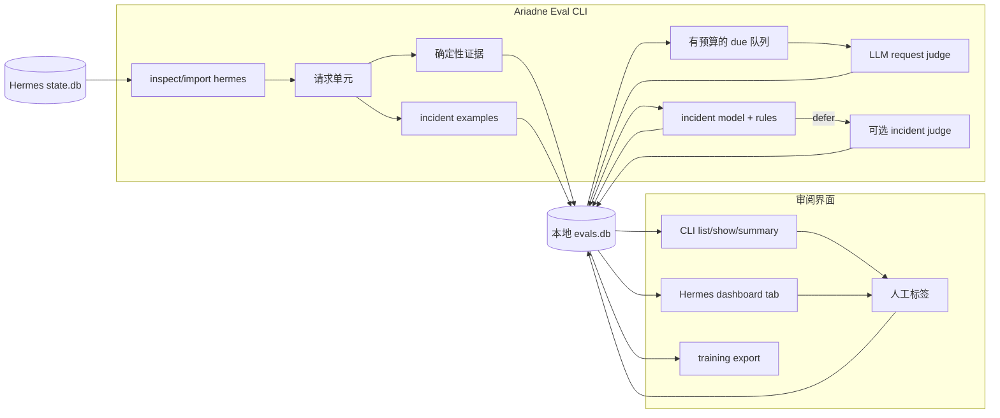

# Ariadne Eval

**面向 Hermes Agent 会话的本地评估工具。**

[English](README.md) | [Deutsch](README.de.md) | 中文 | [Español](README.es.md) | [Русский](README.ru.md)

Ariadne Eval 读取 Hermes 会话历史，并把它整理成可审阅的证据。它不是只看“整段对话最后是否看起来正常”，而是逐个用户请求审阅：请求本身、助手回复、附近的工具活动、如果存在的话还有下一条用户反应，以及这一小段工作里发生了多少可避免的摩擦。

它专门用于发现最终 transcript 里容易被掩盖的问题：

- 助手说任务完成了，但命令或工具其实失败了；
- agent 额外花了多个 turn 重复同一个工具、API 调用或 shell 命令；
- 下一条用户消息是在纠正、抱怨，或重复同一个请求；
- 某个工具结果看起来很严重，但它可能只是预期失败或错误输入，不一定是真 incident；
- 审阅者需要一份本地的已接受 incident 标签集，用于后续训练和校准。

Ariadne Eval 保持本地运行。它读取 Hermes `state.db`，写入 sidecar SQLite 数据库，只通过显式 CLI 命令调用 judge，并且不保存 provider 的隐藏 reasoning。

## 记录内容

| 范围 | 记录的数据 |
|---|---|
| 请求单元 | 每条用户消息一个 eval unit，包含有限的前置上下文、助手回复、工具消息，以及可用时的下一条用户反应。 |
| 确定性证据 | 工具错误、重复动作、API/工具次数、完成声明线索、用户反应分类，以及其他 trace 信号。 |
| 请求判断 | `succeed`、`failed`、`mishandled` 或 `prolonged`，以及 `0.0` 到 `1.0` 的 `request_friction_score`。 |
| Incident 审阅 | 工具调用标签：`incident`、`not_incident` 或 `unsure`，包含 reason code、confidence、reviewer 来源和评论。 |
| 审阅界面 | CLI 输出和可选的 Hermes dashboard 标签页，两者读取同一个本地 `evals.db`。 |

确定性证据是输入，不是裁决。请求 judge 和人工审阅者仍然负责判断 trace 代表什么。

## 数据路径



CLI 负责导入、评估、预测、训练和导出。Dashboard 读取 `evals.db` 并可保存标签；它不导入会话，也不调用 judge。

本地状态存放在：

```text
$HERMES_HOME/instruction-health/
  config.yaml
  evals.db
  logs/
```

## 安装

```bash
git clone git@github.com:merlinhu1/ariadne-eval.git
cd ariadne-eval
python3 -m venv .venv
. .venv/bin/activate
pip install -e .
```

检查 CLI：

```bash
agent-health --help
```

也可以直接从 checkout 运行：

```bash
PYTHONPATH=src python3 -m agent_health.cli --help
```

## 第一次运行

在 Hermes profile 下初始化 Ariadne Eval：

```bash
agent-health --hermes-home ~/.hermes init
```

导入前先检查最近的 Hermes 会话：

```bash
agent-health --hermes-home ~/.hermes inspect hermes --limit 5
```

把最近会话导入 sidecar 数据库：

```bash
agent-health --hermes-home ~/.hermes import hermes --since 24h --limit 100
```

检查规范化后的单元和确定性信号：

```bash
agent-health --hermes-home ~/.hermes units --limit 20
agent-health --hermes-home ~/.hermes signals hermes:<session_id>:turn:<n>
```

对到期单元运行 request judge：

```bash
agent-health --hermes-home ~/.hermes eval --due
```

查看结果：

```bash
agent-health --hermes-home ~/.hermes list --limit 20 --details
agent-health --hermes-home ~/.hermes show hermes:<session_id>:turn:<n>
agent-health --hermes-home ~/.hermes summary
```

`eval --due` 会刻意控制预算。它只考虑一个较小的到期批次，优先处理有确定性证据的单元，除非设置 `--reevaluate` 否则跳过已经判断过的单元，并支持用 `--dry-run` 先查看再消耗 judge 调用。

## Incident 工作流

请求评分问的是：“agent 如何处理这个用户请求？”Incident 审阅问的是更窄的问题：“这个具体工具调用或结果是不是一个真实执行 incident？”

列出仍需审阅的 incident examples：

```bash
agent-health --hermes-home ~/.hermes incident examples --unlabeled --limit 20
```

让 incident judge 标注一个有限批次：

```bash
agent-health --hermes-home ~/.hermes incident judge-label --limit 20 --max-judge-calls 5
```

添加或修正人工标签：

```bash
agent-health --hermes-home ~/.hermes incident label --example-id incident:<id> \
  --label incident --reason-code execution_error --confidence 1.0 \
  --comment "tool failed and the final answer claimed completion"
```

导出已接受标签、训练本地 incident model，并启用 judge deferred 的 ML-first 预测：

```bash
agent-health --hermes-home ~/.hermes incident export-training > incident-training.jsonl
agent-health --hermes-home ~/.hermes incident train --auto-promote
agent-health --hermes-home ~/.hermes incident predict --judge-deferred --max-judge-calls 5
```

预期循环是先积累人工/LLM 标签，然后用 promoted 本地模型处理常规 incident 判断，并可把 deferred 样例交给 LLM judge。人工修正保持可审计，也可以再次导出用于重新训练。

## 仪表盘

安装可选的 Hermes dashboard 标签页：

```bash
agent-health --hermes-home ~/.hermes dashboard install
```

重载或重启 Hermes，然后打开 Ariadne Eval 标签页。它会从本地 `evals.db` 展示请求摩擦、状态、异常、会话、incident examples、预测和标签控件。

Dashboard 的边界是有意收窄的：它只是基于现有本地数据的审阅界面，不负责导入、调度，也不运行 judge。

## 边界

Ariadne Eval V1 不是：

- 托管式观测产品；
- 常驻 scheduler 或后台 daemon；
- 被动 hook 捕获系统；
- 独立 Web dashboard；
- safety 或 policy evaluator；
- 通用 multi-agent adapter framework；
- 自动 prompt、memory 或 skill 编辑器。

这个窄范围是刻意设计的：输入是 Hermes 历史会话，输出是本地证据、判断和审阅标签。

## 开发与验证

运行 Python 测试套件：

```bash
PYTHONDONTWRITEBYTECODE=1 PYTHONPATH=src python3 -m unittest discover -s tests -v
```

运行仓库 truth 检查：

```bash
/opt/data/node/bin/truthmark check --json
/opt/data/node/bin/truthmark index --json
```

有用的项目文档：

- [V1 design](docs/design.md)
- [architecture overview](docs/architecture/system-overview.md)
- [repo rules for agents](docs/ai/repo-rules.md)
- [behavior truth docs](docs/truth/)
