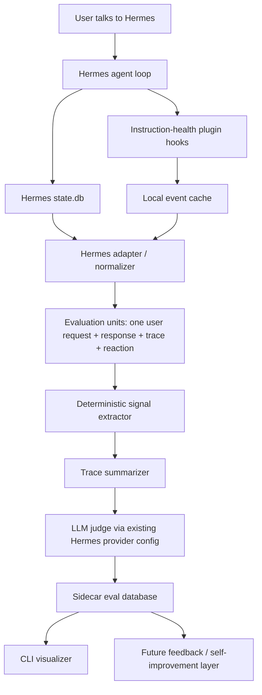

# Agent Instruction Health Evaluator — Design Document

Date: 2026-05-19
Status: concrete MVP design draft
Project name: intentionally omitted from this document
Primary target: Hermes Agent users
Secondary target: future agent-framework adapters

## 1. Overview

This project is a lightweight, local-first developer tool for evaluating the health of agent task runs. It is not a generic LLM observability product and it is not intended to replace full trace platforms. The core use case is: after an agent session or conversation, identify which user requests were handled cleanly, which were failed, which were mishandled, and which completed only after unnecessary or strange steps.

The first implementation should focus on Hermes Agent because Hermes is the priority integration and already stores rich session data. The design should remain agent-agnostic enough that OpenClaw or other agents can later provide adapters, but the MVP should not wait for a perfect universal abstraction.

The evaluator should process every run or user request, but it should not run in real time. A timed batch is cheaper, simpler, and better suited to using the next user message as evidence of whether the previous turn went badly.

The recommended MVP is:

```text
Hermes native plugin
  -> passive hook event capture
  -> Hermes state.db reader
  -> normalized user-turn evaluation units
  -> deterministic trace signals
  -> LLM judge using existing Hermes model connection
  -> sidecar local eval database
  -> CLI visualizer for failed / mishandled / prolonged runs
```

## 2. Summary of the conversation that led to this design

The initial need was a tool that can visualise and summarise mistakes made by an agent. Langfuse was considered because Hermes has a Langfuse observability plugin, but that path is too heavy for this goal. Langfuse is primarily an LLM observability and evaluation platform. It requires trace setup, evaluator setup, and usually another LLM connection for LLM-as-judge. It can show traces, but it does not automatically provide a lightweight local agent-health loop.

The project gap is therefore:

```text
A local, lightweight, agent-focused evaluator that can inspect full agent traces,
identify failed or bumpy task runs, and eventually turn user feedback into
self-improvement leads.
```

The project should especially focus on:

- failed attempts at achieving a user goal;
- mishandled tasks where the agent misunderstood, over-claimed, used tools badly, or required user correction;
- prolonged tasks where the agent eventually succeeds but takes unnecessary or strange steps;
- user reaction as evidence, especially the next user turn after an agent response;
- local storage inside the agent container or profile directory;
- using the existing Hermes model configuration rather than forcing a new LLM API setup.

Current design focus is evaluation and visualisation. User feedback and self-improvement are important future directions, but they should not overload the MVP.

## 3. Goals

The MVP must do the following.

1. Work with Hermes Agent first.
2. Run locally inside or beside the Hermes profile/container.
3. Use Hermes session records as the primary source of truth.
4. Capture enough hook-level event data to reason about tool errors, tool duration, and strange loops.
5. Evaluate every user request in a conversation, not just whole sessions.
6. Use full trace context, not only the final answer.
7. Use the next user message as retrospective evidence when available.
8. Produce structured JSON evaluations that can be queried and visualised.
9. Classify each evaluation unit into one primary health status: `succeed`, `failed`, `mishandled`, `prolonged`, or `not_evaluable`.
10. Avoid Langfuse, hosted dashboards, and extra evaluator-specific API credentials.
11. Avoid storing or using hidden chain-of-thought or provider reasoning fields in the normalized evaluation records.

## 4. Non-goals for MVP

The MVP should not attempt to do the following.

- Build a full web dashboard.
- Replace Langfuse as a general LLM observability platform.
- Evaluate safety or policy compliance.
- Automatically modify Hermes prompts, skills, memories, or configs.
- Build a full user-feedback learning loop.
- Support teams, collaboration, cloud hosting, or multi-user deployments.
- Provide a polished report format before the core framework works.
- Support OpenClaw natively before the Hermes path is working.
- Require a local model to exist before the project can run.

## 5. Hermes integration assumptions

The Hermes-first design is based on the following currently documented Hermes surfaces.

Hermes stores sessions in `~/.hermes/state.db`, a SQLite database. That database includes session metadata, full message history, model configuration, token counts, tool call counts, timestamps, lineage, and full-text search tables.

Hermes also supports native plugin hooks that fire in CLI and gateway sessions. The useful hook events for this project are:

```text
on_session_start
pre_llm_call
post_llm_call
pre_tool_call
post_tool_call
on_session_end
on_session_finalize
post_approval_response
```

Hermes provider/runtime resolution is shared across normal chat, gateway, cron, ACP, and auxiliary model calls. The evaluator should use this existing provider configuration rather than introducing a separate mandatory LLM API key.

Design consequence: the MVP should be a Hermes-native plugin plus a batch evaluator that reads Hermes DB records. Hooks should be passive and fast. Expensive LLM judging should happen later in a timed batch.

## 6. Recommended ingestion mode

Based on the constraints, the recommended ingestion mode is:

```text
Native Hermes plugin + timed batch over Hermes state.db
```

Not pure offline import, because the project needs duration and event-level trace signals that may not be fully represented in the session DB.

Not realtime tracing, because that is expensive, unnecessary, and too close to a Langfuse-style observability service.

Not manual pasted transcript, because Hermes already stores the relevant conversation and tool records.

The plugin should do two things only:

1. Register passive hooks and write lightweight event records.
2. Mark sessions or turns as dirty/evaluation-due.

The batch evaluator should do the expensive work:

1. Read `~/.hermes/state.db`.
2. Join with the plugin event cache.
3. Normalize sessions into user-turn evaluation units.
4. Compute deterministic signals.
5. Summarize the trace.
6. Call the judge model.
7. Store structured evals in the sidecar evaluation DB.

## 7. High-level architecture



## 8. Evaluation unit definition

The evaluator should not score only whole sessions. A session can contain many user requests. It should score each user request as an evaluation unit.

An evaluation unit is anchored on one user message and includes:

```text
current user request
previous conversation context needed to interpret it
assistant final response for that turn
tool calls and tool results between request and response
deterministic trace signals
next user message, if available, as user reaction evidence
session metadata
model/provider metadata
```

The next user message is important. Many failures are only obvious when the user says something like:

```text
No, that is not what I asked.
You did not create the file.
Why did you search the web?
This took too long.
Can you actually finish it?
```

The evaluator should therefore use a retrospective lag policy.

A user-turn evaluation unit becomes due when any of these conditions is met:

1. There is a next user message after the assistant response.
2. The session has ended and a configurable cooldown has passed.
3. The session is inactive for a configurable cooldown.
4. The turn is explicitly requested for evaluation by CLI.

Recommended defaults:

```yaml
evaluation:
  cooldown_minutes_after_session_end: 30
  cooldown_minutes_after_inactive_turn: 120
  evaluate_last_turn_without_reaction: true
  reevaluate_previous_turn_when_next_user_reaction_arrives: true
```

## 9. Health status taxonomy

Each evaluation unit gets one primary `health_status`.

### 9.1 `succeed`

The agent achieved the user’s apparent goal without meaningful avoidable friction.

Examples:

- The user asked for a file and the trace shows it was created.
- The user asked for a summary and the assistant provided one consistent with available context.
- The next user message continues naturally or accepts the result.

### 9.2 `failed`

The agent did not achieve the goal.

Examples:

- The tool failed and the final response did not recover.
- The assistant never completed the requested task.
- The user explicitly says the goal was not achieved.
- The agent ends with inability but the trace suggests it did not exhaust a reasonable path.

### 9.3 `mishandled`

The agent attempted or partially achieved the task but handled it incorrectly.

Examples:

- Misunderstood the user’s intent.
- Used the wrong tool.
- Failed to use a necessary tool.
- Claimed an external action succeeded without trace evidence.
- Ignored important context from earlier in the conversation.
- Over-refused or gave an unhelpfully vague answer and the user pushed back.
- Required a user correction that should have been unnecessary.

### 9.4 `prolonged`

The agent likely achieved or approached the goal, but the path was unnecessarily long, loopy, or strange.

Examples:

- Repeated the same tool call with the same or near-identical arguments.
- Used many tool calls for a simple answer.
- Spent excessive time or API calls before producing a simple result.
- Took detours unrelated to the request.
- Succeeded only after avoidable retries.

### 9.5 `not_evaluable`

There is not enough evidence to judge the run.

Examples:

- The user request was too ambiguous.
- The tool output was missing or truncated beyond usefulness.
- The session ended before an assistant response.
- The user changed the goal before completion.
- The trace lacks enough context to distinguish success from failure.

### 9.6 Status precedence

When multiple statuses seem plausible, use this precedence:

```text
failed > mishandled > prolonged > succeed > not_evaluable
```

`not_evaluable` only wins when the evidence is insufficient. A run can be both prolonged and mishandled internally, but the primary status should be `mishandled` if the strange path caused a wrong or user-hostile outcome.

## 10. Barrier taxonomy

The primary health status is single-value. Barriers are multi-value evidence tags that explain why the status was assigned.

Recommended MVP barrier types:

```text
tool_error
repeated_tool_loop
unnecessary_tool_use
missing_tool_use
bad_tool_selection
external_action_not_verified
action_misrepresentation
misread_instruction
missed_requirement
unsupported_claim
format_mismatch
vague_or_incomplete_response
over_refusal
under_clarification
user_correction
user_repeated_request
interrupted_or_incomplete
excessive_duration
excessive_api_calls
excessive_tool_calls
context_loss
```

Do not over-normalize these too early. Store them as strings, and allow taxonomy changes later.

## 11. Deterministic signal extraction

The LLM judge should not be the only source of truth. Before judging, the system should compute deterministic signals from the trace.

MVP deterministic signals:

| Signal | Source | Purpose |
|---|---|---|
| `tool_call_count` | session DB + hook events | Detect complexity and prolonged runs |
| `api_call_count` | sessions table if available | Detect long loops |
| `turn_duration_seconds` | timestamps + hook events | Detect prolonged runs |
| `same_tool_repeat_count` | hook events | Detect repeated loops |
| `tool_error_count` | tool result JSON / content | Detect tool failures |
| `terminal_nonzero_exit_count` | terminal hook result if available | Detect command failures |
| `approval_denied_count` | approval hook | Detect blocked actions |
| `assistant_claimed_completion` | final response heuristic | Check against tool evidence |
| `next_user_reaction_type` | next user message | Detect correction or dissatisfaction |
| `format_requested` | user request heuristic / LLM extraction | Check format compliance |
| `format_delivered` | final answer parser | Check format mismatch |

Suggested thresholds for MVP:

```yaml
thresholds:
  prolonged_tool_calls: 8
  prolonged_api_calls: 4
  prolonged_turn_minutes: 10
  repeated_same_tool_same_args: 3
  long_tool_result_chars: 8000
```

These thresholds should be configurable because coding tasks and research tasks have different normal ranges.

## 12. User reaction inference

The next user message should be classified before being given to the judge.

Suggested reaction categories:

```text
acceptance
continuation
clarification
correction
complaint
repeated_request
scope_change
unrelated
unknown
```

Rules:

1. Do not assume every correction means the agent failed. The user may be clarifying an ambiguous original request.
2. Do not assume every continuation means success. The user may be continuing because the agent did not finish.
3. Give the judge both the next user message and the deterministic reaction classification.
4. Allow the judge to override the deterministic classification with explanation.

Example deterministic patterns:

```text
correction: "no", "not what", "you didn't", "that's wrong", "actually", "I meant"
complaint: "this is terrible", "why", "too hard", "too complicated", "not useful"
repeated_request: high lexical overlap with previous user request
acceptance: "thanks", "great", "that works", "yes"
scope_change: "now", "next", "also", "can we add"
```

## 13. Data sources in Hermes

### 13.1 Primary source: Hermes `state.db`

Use Hermes `~/.hermes/state.db` as the main data source.

Important fields from `sessions`:

```text
id
source
user_id
model
model_config
system_prompt
parent_session_id
started_at
ended_at
end_reason
message_count
tool_call_count
input_tokens
output_tokens
reasoning_tokens
estimated_cost_usd
actual_cost_usd
title
api_call_count
```

Important fields from `messages`:

```text
id
session_id
role
content
tool_call_id
tool_calls
tool_name
timestamp
token_count
finish_reason
```

Fields to exclude by default:

```text
reasoning
reasoning_content
reasoning_details
codex_reasoning_items
codex_message_items
```

Reason: even if providers expose reasoning fields, this tool should not depend on or display hidden reasoning. Evaluation should use user-visible messages, tool calls, tool results, and metadata.

### 13.2 Supplemental source: plugin event cache

Hermes DB records are necessary but not always enough. The plugin should write lightweight event records to a sidecar event cache.

Suggested path:

```text
$HERMES_HOME/instruction-health/events.jsonl
```

Later, this can become SQLite if needed.

Event types:

```text
session_start
pre_llm_call
post_llm_call
tool_start
tool_end
session_end
session_finalize
approval_response
```

Event schema:

```json
{
  "event_id": "evt_...",
  "schema_version": "event_v1",
  "framework": "hermes",
  "session_id": "...",
  "event_type": "tool_end",
  "timestamp": 1779180000.123,
  "payload": {
    "tool_name": "terminal",
    "args_hash": "sha256:...",
    "args_preview": "...",
    "result_error": true,
    "result_preview": "...",
    "duration_ms": 842
  }
}
```

Payload previews should be capped to avoid storing huge tool outputs twice.

Recommended caps:

```yaml
capture:
  max_args_chars: 4000
  max_result_preview_chars: 4000
  hash_full_args: true
  hash_full_result: true
```

## 14. Sidecar evaluation database

Use a sidecar SQLite database for MVP, not JSONL.

Reason: the source of truth is already SQLite, and the visualizer will need indexed queries over statuses, barriers, sessions, dates, and models.

Suggested path:

```text
$HERMES_HOME/instruction-health/evals.db
```

### 14.1 Table: `eval_units`

```sql
CREATE TABLE eval_units (
    id TEXT PRIMARY KEY,
    framework TEXT NOT NULL,
    source_session_id TEXT NOT NULL,
    source_turn_index INTEGER NOT NULL,
    user_message_id TEXT NOT NULL,
    assistant_message_id TEXT,
    next_user_message_id TEXT,
    started_at REAL,
    ended_at REAL,
    source TEXT,
    model TEXT,
    title TEXT,
    parent_session_id TEXT,
    user_request TEXT NOT NULL,
    assistant_response TEXT,
    previous_context_summary TEXT,
    next_user_reaction_text TEXT,
    tool_call_count INTEGER DEFAULT 0,
    api_call_count INTEGER DEFAULT 0,
    input_tokens INTEGER DEFAULT 0,
    output_tokens INTEGER DEFAULT 0,
    normalization_version TEXT NOT NULL,
    created_at REAL NOT NULL,
    updated_at REAL NOT NULL,
    UNIQUE(framework, source_session_id, source_turn_index)
);
```

### 14.2 Table: `trace_events`

```sql
CREATE TABLE trace_events (
    id TEXT PRIMARY KEY,
    eval_unit_id TEXT NOT NULL REFERENCES eval_units(id),
    source_event_id TEXT,
    event_type TEXT NOT NULL,
    timestamp REAL,
    tool_name TEXT,
    args_hash TEXT,
    args_preview TEXT,
    result_hash TEXT,
    result_preview TEXT,
    result_error INTEGER DEFAULT 0,
    duration_ms INTEGER,
    raw_payload_json TEXT
);
```

### 14.3 Table: `deterministic_signals`

```sql
CREATE TABLE deterministic_signals (
    id INTEGER PRIMARY KEY AUTOINCREMENT,
    eval_unit_id TEXT NOT NULL REFERENCES eval_units(id),
    signal_name TEXT NOT NULL,
    signal_value TEXT NOT NULL,
    severity TEXT,
    evidence TEXT,
    created_at REAL NOT NULL
);
```

### 14.4 Table: `llm_evals`

```sql
CREATE TABLE llm_evals (
    id TEXT PRIMARY KEY,
    eval_unit_id TEXT NOT NULL REFERENCES eval_units(id),
    prompt_version TEXT NOT NULL,
    judge_provider TEXT,
    judge_model TEXT,
    health_status TEXT NOT NULL,
    confidence TEXT NOT NULL,
    primary_reason TEXT NOT NULL,
    eval_json TEXT NOT NULL,
    evaluator_error TEXT,
    created_at REAL NOT NULL
);
```

### 14.5 Table: `barriers`

```sql
CREATE TABLE barriers (
    id INTEGER PRIMARY KEY AUTOINCREMENT,
    eval_id TEXT NOT NULL REFERENCES llm_evals(id),
    eval_unit_id TEXT NOT NULL REFERENCES eval_units(id),
    barrier_type TEXT NOT NULL,
    severity TEXT NOT NULL,
    evidence TEXT,
    source TEXT,
    related_event_id TEXT
);
```

### 14.6 Table: `eval_state`

```sql
CREATE TABLE eval_state (
    key TEXT PRIMARY KEY,
    value TEXT NOT NULL,
    updated_at REAL NOT NULL
);
```

Use `eval_state` for cursors such as last evaluated session timestamp, prompt version, and schema version.

## 15. Hermes plugin design

### 15.1 Plugin location

Suggested development install path:

```text
~/.hermes/plugins/instruction-health/
```

Suggested manifest:

```yaml
name: instruction-health
version: 0.1.0
description: Local agent instruction-health evaluator for Hermes sessions
provides_hooks:
  - on_session_start
  - pre_llm_call
  - post_llm_call
  - pre_tool_call
  - post_tool_call
  - on_session_end
  - on_session_finalize
  - post_approval_response
```

No model-visible tools should be exposed in MVP. The plugin should not change agent behavior. It should not inject context. It should not transform tool results. It should only observe and write sidecar records.

### 15.2 Hook registrations

```python
# __init__.py

def register(ctx):
    ctx.register_hook("on_session_start", on_session_start)
    ctx.register_hook("pre_llm_call", pre_llm_call)
    ctx.register_hook("post_llm_call", post_llm_call)
    ctx.register_hook("pre_tool_call", pre_tool_call)
    ctx.register_hook("post_tool_call", post_tool_call)
    ctx.register_hook("on_session_end", on_session_end)
    ctx.register_hook("on_session_finalize", on_session_finalize)
    ctx.register_hook("post_approval_response", post_approval_response)
```

### 15.3 Hook behavior

| Hook | Capture | Notes |
|---|---|---|
| `on_session_start` | session id, model, platform, start timestamp | initialize local session buffer |
| `pre_llm_call` | session id, user message preview, history length, model, platform | mark a new user turn boundary |
| `post_llm_call` | assistant response preview, model, platform | mark final response for turn |
| `pre_tool_call` | tool name, args preview/hash, task id | record tool start |
| `post_tool_call` | tool name, args hash, result preview/hash, error heuristic, duration | record tool end and latency |
| `post_approval_response` | command preview, approval choice | useful for blocked/denied actions |
| `on_session_end` | completed/interrupted, model, platform | mark session dirty for eval |
| `on_session_finalize` | session id/platform | final flush point |

### 15.4 Performance requirements

Hook code must be fast and fail-open.

Rules:

```text
Do not call an LLM inside hooks.
Do not perform slow DB scans inside hooks.
Do not block the agent loop for evaluation.
Do not mutate the prompt or tool output.
Write short append-only records and return.
Catch exceptions and log only local warnings.
```

## 16. Normalization algorithm

The normalizer converts raw Hermes session data into evaluation units.

### 16.1 Load session

Input:

```text
session_id
```

Steps:

1. Read session row from `sessions`.
2. Read messages for the session ordered by `(timestamp, id)`.
3. If `parent_session_id` exists, optionally load lineage context summary.
4. Join available plugin event records by session id and timestamp windows.
5. Exclude reasoning fields.

### 16.2 Identify user-turn boundaries

Basic rule:

```text
Each user message starts a candidate eval unit.
The assistant response that follows it closes the eval unit.
Tool calls/results between them belong to that eval unit.
The next user message after the assistant response is reaction evidence.
```

Pseudocode:

```python
def normalize_session(messages):
    units = []
    for i, msg in enumerate(messages):
        if msg.role != "user":
            continue

        user_msg = msg
        assistant_msg = find_next_assistant_final(messages, start=i + 1)
        next_user_msg = find_next_user_after(messages, assistant_msg)
        tool_events = collect_tool_events_between(messages, user_msg, assistant_msg)
        context = collect_previous_context(messages, before=i, max_turns=6)

        units.append(EvalUnit(
            user_message=user_msg,
            assistant_message=assistant_msg,
            next_user_message=next_user_msg,
            previous_context=context,
            tool_events=tool_events,
        ))
    return units
```

### 16.3 Conversation context

For each eval unit, include enough previous context for the judge to understand pronouns, references, and corrections.

Recommended MVP strategy:

```text
Include the previous 3 user/assistant pairs verbatim if small.
If larger than max chars, summarize previous context using a cheap summary prompt.
Always include the current user request verbatim.
Always include the final assistant response verbatim up to configured cap.
Summarize tool outputs instead of passing raw full output.
```

Suggested caps:

```yaml
context:
  previous_turn_pairs: 3
  max_previous_context_chars: 6000
  max_user_request_chars: 4000
  max_assistant_response_chars: 8000
  max_tool_result_chars_per_call: 1500
  max_total_judge_input_chars: 24000
```

## 17. Trace summarization

The judge should receive a compact trace, not raw logs.

Trace summary format:

```json
{
  "tool_sequence": [
    {
      "index": 1,
      "tool_name": "terminal",
      "args_summary": "ran pytest",
      "result_summary": "failed: 3 tests failed",
      "error": true,
      "duration_ms": 1200
    }
  ],
  "deterministic_signals": [
    {
      "name": "tool_error_count",
      "value": 3,
      "severity": "medium",
      "evidence": "terminal returned errors in calls 2, 3, and 4"
    }
  ],
  "timing": {
    "turn_duration_seconds": 740,
    "api_call_count": 6,
    "tool_call_count": 11
  },
  "next_user_reaction": {
    "type": "correction",
    "text": "No, you didn't create the file."
  }
}
```

Trace summarization can be deterministic at first. Do not use another LLM call just to summarize unless the trace is too large.

## 18. LLM judge design

### 18.1 Connection strategy

The judge should use the existing Hermes model connection by default.

Recommended config:

```yaml
instruction_health:
  judge:
    provider: main
    model: main
    temperature: 0
    max_retries: 2
    prompt_version: instruction_health_v1
```

`provider: main` and `model: main` mean: use the same provider/model resolution that Hermes uses for the active profile, unless the user explicitly configures a different judge model.

Important caveat: local-first storage does not automatically mean local-only inference. If the current Hermes model is a remote provider, evaluation data will be sent to that same provider. That is still simpler than requiring a separate Langfuse evaluator API key, but it is not fully local inference unless Hermes itself is configured to use a local endpoint.

### 18.2 Judge output must be strict JSON

Structured output is mandatory. Visualisation depends on queryable fields. Natural language is allowed only inside JSON fields such as `primary_reason` and `evidence`.

Invalid JSON handling:

1. Try to parse the model output.
2. If parsing fails, retry with a repair instruction and the invalid output.
3. If parsing still fails, store an `evaluator_error` row and keep deterministic signals.

### 18.3 Judge prompt

```text
You are evaluating the health of an AI agent's handling of one user request.

Assess the agent charitably but evidence-first. The user may clarify ambiguous intent.
Do not mark a run as bad merely because the user added a new request later.
Do mark a run as mishandled if the next user message shows that the agent misunderstood,
failed to complete the requested action, over-claimed completion, used tools badly, or gave
a response that forced unnecessary correction.

Use the full trace, not only the final answer.
Do not reward verbosity.
Do not infer that an external action succeeded unless the trace supports it.
Do not use hidden reasoning. Only use the supplied user messages, assistant messages,
tool trace summary, metadata, and deterministic signals.

Return exactly one JSON object matching this schema:

{
  "schema_version": "instruction_health_eval_v1",
  "health_status": "succeed | failed | mishandled | prolonged | not_evaluable",
  "confidence": "high | medium | low",
  "goal_summary": "one sentence",
  "observed_outcome": "one sentence",
  "primary_reason": "one sentence",
  "user_reaction": {
    "type": "acceptance | continuation | clarification | correction | complaint | repeated_request | scope_change | unrelated | unknown | none",
    "used_as_evidence": true,
    "evidence": "short quote or paraphrase"
  },
  "barriers": [
    {
      "type": "tool_error | repeated_tool_loop | unnecessary_tool_use | missing_tool_use | bad_tool_selection | external_action_not_verified | action_misrepresentation | misread_instruction | missed_requirement | unsupported_claim | format_mismatch | vague_or_incomplete_response | over_refusal | under_clarification | user_correction | user_repeated_request | interrupted_or_incomplete | excessive_duration | excessive_api_calls | excessive_tool_calls | context_loss",
      "severity": "low | medium | high",
      "source": "trace | assistant_response | user_reaction | deterministic_signal",
      "evidence": "short evidence statement"
    }
  ],
  "prolongation_evidence": {
    "tool_calls": 0,
    "api_calls": 0,
    "duration_seconds": null,
    "repeated_actions": []
  },
  "missed_or_mishandled_requirements": [],
  "not_evaluable_reason": null
}

Status definitions:
- succeed: the user goal was achieved without meaningful avoidable friction.
- failed: the user goal was not achieved.
- mishandled: the agent attempted or partially achieved the goal but misunderstood, over-claimed, used bad tools, missed requirements, or needed avoidable correction.
- prolonged: the goal was achieved or nearly achieved but the trace contains unnecessary loops, detours, or excessive steps.
- not_evaluable: there is insufficient evidence to judge.

Status precedence:
failed > mishandled > prolonged > succeed > not_evaluable.
Use not_evaluable only when evidence is insufficient.

Input:
{{eval_unit_json}}
```

## 19. CLI design

Use a placeholder command name until the repo name is chosen. In examples below, use `agent-health`.

### 19.1 Initialization

```bash
agent-health init --hermes-home ~/.hermes
```

Creates:

```text
~/.hermes/instruction-health/
  config.yaml
  events.jsonl
  evals.db
  logs/
```

### 19.2 Plugin installation

```bash
agent-health hermes install-plugin --hermes-home ~/.hermes
hermes plugins enable instruction-health
```

### 19.3 Import and normalize Hermes sessions

```bash
agent-health import hermes --hermes-home ~/.hermes --since 7d
```

### 19.4 Run due evaluations

```bash
agent-health eval --due --limit 50
```

### 19.5 Show bumpy runs

```bash
agent-health list --status failed,mishandled,prolonged --since 7d
```

Example output:

```text
TIME                STATUS       SESSION       TURN  BARRIERS                         REQUEST
2026-05-19 10:42    mishandled   abc123        4     user_correction,missing_tool_use  "Create a markdown design doc..."
2026-05-19 09:10    prolonged    def456        2     repeated_tool_loop,tool_error     "Fix the test failure..."
2026-05-18 22:31    failed       ghi789        1     action_misrepresentation          "Send the email..."
```

### 19.6 Inspect one eval unit

```bash
agent-health show abc123:4
```

Output sections:

```text
Status
Primary reason
User request
Assistant response summary
Next user reaction
Tool sequence
Deterministic signals
Barriers
Raw trace pointers
```

### 19.7 Minimal summary

Report format can be refined later, but the first summary should exist for sanity checking.

```bash
agent-health summary --since 7d
```

Example output:

```text
Evaluated turns: 118
succeed: 82
failed: 7
mishandled: 18
prolonged: 9
not_evaluable: 2

Top barriers:
1. user_correction: 11
2. excessive_tool_calls: 8
3. missing_tool_use: 6
4. action_misrepresentation: 3
```

## 20. Batch scheduling

The MVP should support manual runs first. Timed batch can be added with either OS scheduling or a lightweight in-process scheduler.

Recommended order:

1. Manual CLI batch.
2. OS cron/systemd timer inside the container.
3. Optional Hermes cron integration later.

Example cron:

```cron
*/30 * * * * agent-health eval --due --limit 50 >> ~/.hermes/instruction-health/logs/eval.log 2>&1
```

Avoid using Hermes itself as the first scheduler because the evaluator should not depend on an agent loop to evaluate the agent loop.

## 21. Agent-agnostic adapter layer

Do not build a large generic framework in MVP. Build a small adapter interface around evaluation units.

```python
from typing import Protocol, Iterable

class AgentAdapter(Protocol):
    framework_name: str

    def discover_due_sources(self, since: float | None = None) -> Iterable[str]:
        """Return source ids, e.g. Hermes session ids."""

    def load_source(self, source_id: str) -> dict:
        """Load raw framework-specific session/run data."""

    def normalize_eval_units(self, raw_source: dict) -> list[dict]:
        """Return normalized eval-unit dictionaries."""

    def load_trace_events(self, eval_unit_id: str) -> list[dict]:
        """Return normalized event dictionaries."""
```

Hermes adapter implementation:

```text
HermesAdapter
  source: ~/.hermes/state.db
  supplemental source: ~/.hermes/instruction-health/events.jsonl
  source id: session_id
  eval unit id: hermes:<session_id>:turn:<n>
```

Future OpenClaw adapter:

```text
OpenClawAdapter
  source: to be discovered later
  source id: OpenClaw conversation/task id
  eval unit id: openclaw:<source_id>:turn:<n>
```

The normalized schema should be allowed to evolve. Do not overfit the first design to OpenClaw before OpenClaw’s current log/session internals are verified.

## 22. Privacy and locality

Storage is local by default:

```text
$HERMES_HOME/instruction-health/
```

The evaluator should not create cloud resources.

The evaluator should not require Langfuse credentials.

The evaluator should not read or store hidden chain-of-thought fields from Hermes messages.

The evaluator should not send data to a new provider by default. It should use the provider/model already configured for Hermes. However, if the configured Hermes model is remote, judge inputs will still leave the machine. The CLI should print this clearly during `init` and `eval`:

```text
Judge provider resolved to <provider>/<model>.
Evaluation data will be sent through the same provider path Hermes uses.
Use a local/custom provider if you require fully local inference.
```

No redaction is required in MVP based on current scope, but the design should leave room for a future pre-judge redaction layer.

## 23. Handling incomplete sessions

The system should support incomplete conversations but not build crash forensics in MVP.

Rules:

- If a user request has no assistant response and the session is inactive, create an eval unit with `health_status = not_evaluable` or `failed` depending on evidence.
- If a turn was interrupted, include `interrupted_or_incomplete` as a barrier.
- If the process crashed and no trace exists, do not attempt root-cause analysis in MVP.
- If `on_session_end` says `completed=false` or `interrupted=true`, record that as deterministic evidence.

## 24. Visualisation model

For MVP, visualisation means queryable, structured summaries in CLI output.

The first visualisations should answer:

```text
Which recent turns were failed, mishandled, or prolonged?
Why were they classified that way?
What user reaction suggested the problem?
What tools were involved?
Which barriers repeat most often?
```

Do not build charts before the evaluator is reliable. Once the schema stabilizes, charts can be added from the sidecar DB.

Future visual options:

```text
local TUI
small FastAPI/HTML dashboard
SQLite-backed static report
Grafana over SQLite/DuckDB export
```

## 25. Implementation roadmap

### Phase 0 — Hermes data inspection

Deliverables:

- Confirm current Hermes `state.db` schema on a real profile.
- Write a small script that lists recent sessions and messages.
- Confirm how tool calls/tool results are represented in actual DB rows.
- Confirm whether `api_call_count`, `tool_call_count`, and token fields are populated reliably.

Acceptance criteria:

```text
agent-health inspect hermes --hermes-home ~/.hermes
```

prints recent sessions, user messages, assistant messages, tool calls, and tool results without using an LLM.

### Phase 1 — Normalized eval units

Deliverables:

- `HermesAdapter`.
- Eval-unit normalization.
- Sidecar `evals.db` schema.
- CLI command to list due eval units.

Acceptance criteria:

```bash
agent-health import hermes --since 24h
agent-health units --since 24h
```

shows one row per user request, including current request, final assistant response presence, next user reaction presence, and tool count.

### Phase 2 — Passive Hermes plugin

Deliverables:

- `~/.hermes/plugins/instruction-health/plugin.yaml`.
- Hook registration.
- `events.jsonl` capture.
- Session dirty marker.

Acceptance criteria:

After a normal Hermes conversation, `events.jsonl` contains session, LLM, and tool events, and Hermes behavior is unchanged.

### Phase 3 — Deterministic signals

Deliverables:

- Tool error detection.
- Repeated tool detection.
- Prolonged run detection.
- User reaction classifier.
- Completion-claim heuristic.

Acceptance criteria:

```bash
agent-health signals <eval_unit_id>
```

shows deterministic evidence without calling an LLM.

### Phase 4 — LLM judge

Deliverables:

- Judge prompt v1.
- Existing-Hermes-provider connection path.
- Strict JSON parser and retry.
- `llm_evals` and `barriers` storage.

Acceptance criteria:

```bash
agent-health eval --due --limit 10
agent-health list --status failed,mishandled,prolonged
```

returns structured statuses and barriers.

### Phase 5 — CLI visualizer

Deliverables:

- `list` command.
- `show` command.
- `summary` command.
- Raw trace pointers back to Hermes session/message ids.

Acceptance criteria:

A Hermes user can identify recent bumpy turns and inspect why they were judged bumpy without opening raw logs manually.

### Phase 6 — Future feedback and improvement leads

Not MVP. Keep this as a future extension.

Possible future additions:

- `agent-health feedback <eval_unit_id>`.
- User correction stored as first-class evidence.
- Feedback override of judge status.
- Re-evaluation after feedback.
- Candidate lessons learned.
- Candidate prompt patches.
- Candidate regression tests.
- Human approval queue before writing anything back into Hermes memory, skills, or config.

## 26. MVP acceptance criteria

The MVP is successful when all of the following are true.

1. It installs as a Hermes plugin.
2. It can run inside the same container/profile as Hermes.
3. It uses Hermes `state.db` as the primary source of truth.
4. It captures supplemental hook events without changing agent behavior.
5. It normalizes a conversation into per-user-request eval units.
6. It evaluates every due user request.
7. It uses the next user message as reaction evidence when available.
8. It classifies turns into `succeed`, `failed`, `mishandled`, `prolonged`, or `not_evaluable`.
9. It stores strict JSON eval outputs in local SQLite.
10. It lists failed, mishandled, and prolonged turns from the CLI.
11. It does not require Langfuse.
12. It does not require a separate evaluator API key.
13. It does not store hidden reasoning fields in normalized eval records.
14. It remains useful even if the LLM judge is unavailable by showing deterministic signals.

## 27. Main risks and mitigations

### Risk: Hermes schema changes

Mitigation:

- Prefer importing Hermes `SessionDB` APIs if available.
- Fall back to raw SQL only where needed.
- Store detected Hermes schema version.
- Add `agent-health doctor` to warn on unsupported schemas.

### Risk: Judge is biased because it uses the same model as the agent

Mitigation:

- Accept this for MVP because avoiding another API is a core goal.
- Store judge model/provider with every eval.
- Allow optional separate judge config later.
- Preserve deterministic signals so users can audit the judge.

### Risk: User reaction is ambiguous

Mitigation:

- Use reaction as evidence, not absolute truth.
- Let the judge classify scope changes separately from corrections.
- Use `confidence = low` when uncertain.

### Risk: Too much data sent to judge

Mitigation:

- Cap tool outputs.
- Summarize traces deterministically.
- Include only previous context needed for the current user request.
- Exclude hidden reasoning fields.

### Risk: Hooks slow down Hermes

Mitigation:

- Append short records only.
- No LLM calls in hooks.
- No heavy DB reads in hooks.
- Catch all hook exceptions.

### Risk: The evaluator becomes too broad

Mitigation:

- Keep self-improvement and user feedback as future extensions.
- Keep reporting minimal until eval schema works.
- Keep OpenClaw support as Phase 2.

## 28. Concrete first implementation tasks

1. Create repo skeleton.
2. Add Python package with CLI entry point `agent-health` as placeholder.
3. Add config loader for `$HERMES_HOME/instruction-health/config.yaml`.
4. Implement `HermesStateReader` that reads `sessions` and `messages` from `state.db`.
5. Implement `inspect hermes` command.
6. Implement `HermesAdapter.normalize_eval_units()`.
7. Create sidecar `evals.db` and migrations.
8. Implement deterministic signal extractor.
9. Implement Hermes plugin event capture.
10. Implement `events.jsonl` reader and event joiner.
11. Implement trace summary builder.
12. Implement judge prompt v1.
13. Implement Hermes-provider judge client.
14. Implement JSON parsing and retry.
15. Implement `eval --due`.
16. Implement `list`, `show`, and `summary` commands.
17. Add fixtures with synthetic Hermes DB rows.
18. Add tests for multi-turn reaction handling.
19. Add tests for repeated tool loops.
20. Add tests for action misrepresentation.

## 29. Suggested repository structure

```text
.
├── pyproject.toml
├── README.md
├── docs/
│   └── design.md
├── src/
│   └── agent_health/
│       ├── __init__.py
│       ├── cli.py
│       ├── config.py
│       ├── db.py
│       ├── adapters/
│       │   ├── __init__.py
│       │   ├── base.py
│       │   └── hermes.py
│       ├── hermes_plugin/
│       │   ├── plugin.yaml
│       │   └── __init__.py
│       ├── normalize.py
│       ├── signals.py
│       ├── reactions.py
│       ├── trace_summary.py
│       ├── judge.py
│       ├── prompts/
│       │   └── instruction_health_v1.txt
│       └── visualize.py
├── tests/
│   ├── fixtures/
│   │   └── hermes_state_sample.db
│   ├── test_hermes_reader.py
│   ├── test_normalize.py
│   ├── test_signals.py
│   └── test_judge_schema.py
└── examples/
    └── config.yaml
```

## 30. Open questions to resolve during implementation

These should be answered by inspecting a real Hermes installation and writing the first importer.

1. Does Hermes always write tool result messages with stable `tool_call_id` and `tool_name`?
2. Are `api_call_count` and `tool_call_count` reliable per session for all surfaces?
3. Does `post_llm_call` fire after every user turn in the same way for CLI and gateway sessions?
4. How should background sessions be represented in the eval unit id?
5. Can the evaluator cleanly import Hermes runtime provider helpers from a plugin/CLI package without depending on internal unstable imports?
6. What is the safest way to resolve `HERMES_HOME` for profile aliases?
7. Should long-running coding tasks have different prolonged thresholds than short chat tasks?
8. Should the first visualizer show session-level rollups or only turn-level rows?

## 31. References consulted

- Hermes Event Hooks: https://hermes-agent.nousresearch.com/docs/user-guide/features/hooks
- Hermes Build a Plugin guide: https://hermes-agent.nousresearch.com/docs/guides/build-a-hermes-plugin
- Hermes Built-in Plugins: https://hermes-agent.nousresearch.com/docs/user-guide/features/built-in-plugins
- Hermes Session Storage: https://hermes-agent.nousresearch.com/docs/developer-guide/session-storage
- Hermes Sessions user guide: https://hermes-agent.nousresearch.com/docs/user-guide/sessions
- Hermes Provider Runtime Resolution: https://hermes-agent.nousresearch.com/docs/developer-guide/provider-runtime
- Hermes Programmatic Integration: https://hermes-agent.nousresearch.com/docs/developer-guide/programmatic-integration
